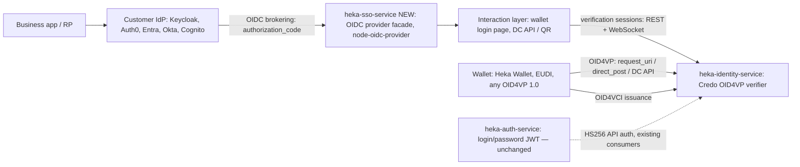
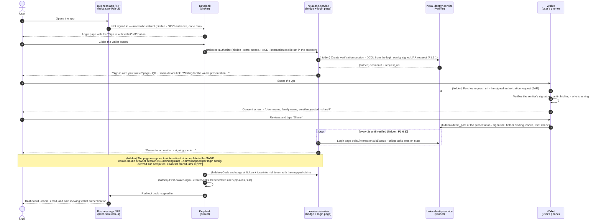

# Integration Notes — heka-sso-service on node-oidc-provider

Companion to [Architecture of oidc-provider.md](<Architecture of oidc-provider.md>) (library internals) and [Feasibility & High-Level Design.md](<../../docs/Feasibility & High-Level Design.md>) (product design, "the feasibility doc"). This document maps that design onto the platform and carries the implementation plan for the new service.

> **Platform decisions**
>
> 1. **heka-sso-service is a new, separate project** in this repository (a sibling of `heka-auth-service`, `heka-identity-service`, `heka-wallet`), exactly as the feasibility doc recommends (its Risk #7). The earlier idea of building the bridge inside heka-auth-service is **superseded**: an internet-facing, spec-compliant AS does not share a process, database, or security posture with the legacy password service.
> 2. **Clean separation of duties.** `heka-auth-service` stays what it is — **simple login/password** JWT issuance for its existing consumers (heka-identity-service API auth) — and is not modified by this plan. `heka-sso-service` handles **VC (wallet) login only**: a standard OIDC provider facade whose sole authentication method is OID4VP presentation. The two services share no code, no database tables, and no keys.
> 3. **No SSI logic in heka-sso-service.** All verification and issuance stays in heka-identity-service (Credo); the bridge orchestrates its **existing** verification-session API. `features.openid4vci` stays disabled — heka-identity-service is the platform's sole OID4VCI issuer and wallets interact with it directly.
>
> This document lives in `heka-sso-service/docs/` (moved here as part of the Phase 0 scaffold), together with the library architecture notes; the feasibility doc remains in the repo-root `docs/`.

Target topology:



---

## 1. IdP brokering (Keycloak first)

The IdP brokers logins to heka-sso-service: the bridge is the **external OIDC Identity Provider**, the IdP registers it and delegates authentication via the standard authorization code flow. Keycloak is the first-supported IdP; the OP surface targets the common denominator of Keycloak, Auth0, Entra External ID, Okta, and Cognito (feasibility §3.4).

### Steps on the bridge (OP side)

1. **Build a production-ready OP**
   - The service is a thin host around `new Provider('https://sso.example.com', config)` (`provider.callback()` mounted at the app root — the whole service *is* the OP, no path prefix needed).
   - Implement the **adapter** (contract in `example/my_adapter.js`), **`findAccount`**, and the **interaction routes** (wallet login UI).
   - Production config: `features.devInteractions: false`, real `jwks` signing keys, `cookies.keys`, sensible `ttl`, `renderError`. Behind TLS offloading set `provider.proxy = true`.

2. **Register the IdP as a client.** Keycloak's broker redirect URI is deterministic:

   `https://<keycloak-host>/realms/<realm>/broker/<idp-alias>/endpoint`

   ```js
   clients: [{
     client_id: 'keycloak-broker',
     client_secret: '<strong secret>',
     grant_types: ['authorization_code'],
     response_types: ['code'],
     redirect_uris: ['https://keycloak.example.com/realms/myrealm/broker/my-auth/endpoint'],
     token_endpoint_auth_method: 'client_secret_basic', // also enable client_secret_post (Cognito/Entra floor)
   }]
   ```

3. **Expose the claims the IdP needs.** Claims come from the **verified credential via the login configuration's claim mapping** (§4.2) — there is no local user table. Include `email` + `email_verified` when the credential discloses them (Entra/Okta functionally require email; pair with Keycloak "Trust Email"), the full disclosed set under `vc_presented_attributes`, `amr: ["vc"]`, and the login-config id in a custom claim. Keep `subjectTypes: ['public']` with **stable `sub` values** per the configured `sub` strategy (§4.3) — the IdP links federated identities by `(idp-alias, sub)`.

4. **Mind the broker requirements matrix** (feasibility §3.4): RS256 default (+ ES256), `kid` in header and JWKS, `sid` for logout, echo `state` verbatim with no length limit, always echo `nonce` (Keycloak hard-fails otherwise), slightly back-dated `iat` (Keycloak defaults to 0s clock skew), userinfo `sub` identical to the id_token, and the Auth0 quirk: all needed claims must be in the id_token because Auth0 never calls userinfo. `node-oidc-provider` covers essentially all of this out of the box — it is configuration + conformance testing, not implementation.

5. **Verify discovery**: `https://sso.example.com/.well-known/openid-configuration` must resolve — IdPs import endpoints, JWKS URI, and algorithms from it.

### Steps on the Keycloak side

6. **Add the Identity Provider**: Realm → Identity Providers → *OpenID Connect v1.0*. Paste the discovery URL (auto-fills endpoints), set the alias (must match the redirect URI, e.g. `my-auth`), client ID/secret from step 2, enable *Validate signatures* with *Use JWKS URL*, enable PKCE (`S256`) — node-oidc-provider requires PKCE by default. Optionally "Trust Email".

7. **Configure mappers**: Attribute Importer for `given_name`/`family_name`/etc. (sync mode `force`), optionally Advanced Claim → Role from `vc_presented_attributes`. First-broker-login flow: default auto-create, or "Detect Existing Broker User" for pre-registered-only populations.

8. **Optional hardening**: `features.backchannelLogout` / `rpInitiatedLogout` with logout URLs registered on both sides (`end_session_endpoint` honoring `id_token_hint` + `post_logout_redirect_uri`; back-channel logout tokens `sid`-matched).

9. **Test the loop**: protected app → Keycloak login → "Sign in with wallet" IdP button → bridge interaction (wallet presentation) → code exchange at the bridge's `/token` → Keycloak creates/links the federated user and issues its own tokens — zero changes to downstream applications.

---

## 2. OID4VCI — supported by the library, **not used in this service**

> **Decision**: heka-sso-service performs **no credential issuance**. heka-identity-service (Credo) is the platform's **sole OID4VCI issuer**; wallets interact with it directly for issuance. `features.openid4vci` remains disabled here, and none of the application-side pieces below (`issueCredential`, Credential Offers, pre-authorized codes) will be implemented in this service. The feasibility doc's bridge design likewise contains no issuance role. The library research below is retained for reference in case the boundary is ever revisited.

The library implements the **issuer role** of OpenID for Verifiable Credential Issuance 1.0 behind `features.openid4vci` (`lib/helpers/defaults.js`, `lib/actions/credential.js`).

### What the library provides

1. **Credential Issuer Metadata** endpoint (`/.well-known/openid-credential-issuer`), **Credential endpoint** (`/credential`), and **Nonce endpoint** for `c_nonce` challenges (derived from a configured 32-byte `nonceSecret`, stateless and multi-instance safe).
2. Proof validation for **`jwt`** and **`attestation`** proof types (attestation needs `getKeyAttestationSignaturePublicKey` to resolve the wallet provider's key).
3. **Pre-Authorized Code grant** (`urn:ietf:params:oauth:grant-type:pre-authorized_code`) with single-use codes and constant-time `tx_code` validation (`lib/actions/grants/pre_authorized_code.js`).
4. Authorization-code-based issuance, wired to the credential endpoint through `features.resourceIndicators` (`defaultResource` / `useGrantedResource` / `getResourceServerInfo` — the exact recipe is in the `openid4vci` JSDoc in `defaults.js`).

### What the application would have to provide (not applicable here)

- **`issueCredential`** — the actual credential construction and signing; **Credential Offer** creation and delivery; `issuer_state` support via `extraParams`.

### Caveats (if ever enabled)

1. Experimental: requires `openid4vci: { enabled: true, ack: 'experimental-01' }` and **`~` version pinning** — breaking changes to experimental features ship in minor releases.
2. Credential-endpoint access tokens must use the **`opaque`** format, with audience equal to the credential endpoint (see `credentialEndpointExpectedAudience`).

---

## 3. OID4VP — the login method, implemented in the interaction layer

There is **no OID4VP surface** in `lib/` (no `vp_token`, no DCQL, no verifier role) — and none is needed. The provider redirects to `interactions.url` and does not care how identity is established; **wallet presentation is the (only) login method** of the bridge, and verification is fully delegated to heka-identity-service's **existing** verification-session API (feasibility §2.2):

| Capability | Existing heka-identity-service asset |
|---|---|
| Create OID4VP authorization requests (DCQL, signed/unsigned, `direct_post(.jwt)`, `dc_api(.jwt)`) | `POST /openid4vc/verification-session/request` |
| Wallet-facing OID4VP endpoints (`request_uri`, `response_uri`) | Credo public router at `:3003/oid4vp` |
| Verify presentations & extract disclosed attributes | Poll `GET /verification-session/:id` until `ResponseVerified`; `extractAttributesFromPresentation` (SD-JWT VC, JWT-VC, mdoc) |
| Browser-mediated same-device flow (DC API, origin-bound) | `POST /verification-session/:id/verify` |
| Async completion signals | Webhooks + WebSocket subscriptions |
| Declarative "what to ask for" | Verification templates |

### The login interaction

1. **Start**: at `/interaction/:uid` the bridge creates a verification session in heka-identity-service (DCQL query from the login configuration, fresh nonce). The login page **feature-detects the Digital Credentials API and prefers it** (`navigator.credentials.get()` — origin+session-bound, immune to cross-device session fixation by construction); otherwise it renders a QR code (cross-device) or wallet deep link (same-device).
2. **Complete**: the wallet responds **directly to heka-identity-service** (`direct_post` / DC API verify endpoint), which validates signature, holder binding, nonce, and status. The login page learns of completion via WebSocket push (polling fallback).
3. **Bind**: the authorization code is released **only into the browser session that initiated `/authorize`** (interaction cookie) — never into the wallet's return channel. The wallet's response resolves the *verification session*; the browser redeems it (feasibility §3.3's critical binding rule).
4. **Resume the OIDC flow**: compute `sub` per the login configuration's strategy (§4.3), persist the mapped claims for token issuance, then

   ```js
   await provider.interactionFinished(req, res, {
     login: { accountId: computedSub, amr: ['vc'] },
   });
   ```

   Tokens are then issued normally; credential-derived claims flow into id_tokens/userinfo via `findAccount`'s `claims()` (§4.4).

### The login journey — user perspective (cross-device / QR, as implemented in Phase 1)

What the user sees and does, with the machinery they never see marked *(hidden)*. Companion to the feasibility doc's technical sequence (§3.3 there); this is the P1.6 implementation: QR + polling (P1.6.3 — DC API lands in P2.1, WebSocket push in P2.2).



Key property visible in the diagram: the wallet's response (step 15) goes to heka-identity-service, never to the user's browser — the browser only learns "verified" by polling and completes the login in the tab that started it. Scanning a relayed QR can therefore never sign the attacker in (§3.3 / feasibility §3.6-1).

### Summary

| Flow | Library support | Where it lives |
|---|---|---|
| IdP brokering (OIDC) | Full — standard authorization code flow | Provider config (`clients`, `claims`, `findAccount`) |
| OID4VCI issuance | Built-in, experimental — **not enabled here** | **heka-identity-service (Credo)** — wallets interact with it directly |
| OID4VP authentication | None — by design | Interaction routes, delegating verification to **heka-identity-service's existing verification-session API** |
| Login/password | Not part of the bridge | **heka-auth-service** — unchanged, existing consumers only |

---

## 4. Design alignment with the feasibility doc

How the feasibility doc's high-level design (§3 there) lands in the new project.

### 4.1 Component

`heka-sso-service` — a new platform component (NestJS, Node 22, TypeScript, MikroORM/PostgreSQL, Yarn 4), scaffolded from the existing component pattern (heka-auth-service is the closest template: config module, pino logging, health module, migrations, Dockerfile/compose, CI workflow). Modules:

- **OP core**: `node-oidc-provider` instance (async factory) + MikroORM adapter.
- **Interaction service**: wallet login page + verification-session orchestration against heka-identity-service.
- **Login configurations**: declarative per-client configs (static in MVP, Postgres + admin API in Phase 2).
- **Admin API** (Phase 2): CRUD for OIDC clients and login configurations; screens in heka-identity-service-web-ui.
- **Storage**: PostgreSQL — clients, login configs, interactions/grants (adapter), verified-claims store, key material. Own database/schema; **no tables shared with heka-auth-service**.

### 4.2 Login configurations (declarative, per client)

Stored in Postgres (static JSON/env in the MVP), CRUD via admin API in Phase 2:

- reference to a **verification template / DCQL query** (which credentials, claims, issuer constraints);
- **claim mapping**: credential-query id + claim path → OIDC claim name (e.g. `pid.given_name → given_name`), plus static claims;
- **`sub` strategy** (§4.3) and **trust policy** (accepted issuers/trust anchors, revocation policy);
- selected per OIDC client (default) or per request via a `login_config:<id>` scope value (Keycloak's per-IdP "Default Scopes" carries this).

### 4.3 `sub` strategies

| Strategy | Behavior | Use when |
|---|---|---|
| `derived` (**default**) | `HMAC(salt, client_id ‖ stable-claim-set)` — stable *and* pairwise per RP | Privacy-preserving stable login |
| `credential-claim` | A nominated claim (personal ID number, employee ID) | The credential carries a stable unique identifier whose disclosure is acceptable |
| `ephemeral` | Random per session | Pure attribute-gating, no account continuity |

**Never** the holder DID / key-binding key: SD-JWT VC key-binding keys rotate per credential and EUDI PIDs have no stable holder key — logins would silently become new users.

### 4.4 Identity data flow (no local user table)

The bridge has **no user table** and mints no identity from local state. The interaction stores the verified, mapped claim set (keyed by the computed `sub`) when the presentation completes; `findAccount` resolves that stored claim set — `accountId` *is* the computed `sub`. Mapped claims land as standard OIDC claims; the full disclosed set is additionally available under `vc_presented_attributes`; `amr: ["vc"]` and the login-config id claim let downstream policy tell how the user authenticated. Account creation/linking happens **in the IdP** (Keycloak first-broker-login), not in this service.

### 4.5 Separation from heka-auth-service

The split now matches the feasibility recommendation directly; the boundary is:

| | heka-auth-service (existing, unchanged) | heka-sso-service (new) |
|---|---|---|
| Purpose | Simple login/password JWT issuance | "Sign in with wallet" OIDC bridge |
| Authentication | Username + password against `auth_user` | OID4VP credential presentation only |
| Tokens | HS256, shared secret with heka-identity-service | Asymmetric JWKS (RS256/ES256), standard OIDC |
| Consumers | heka-identity-service API auth, demo tooling | Any IdP with OIDC brokering; any OIDC RP |
| Exposure | Internal | Internet-facing AS |
| Storage | Own Postgres (`auth_user`, `token`) | Own Postgres (adapter, login configs, claims, keys) |

Rules: no shared code, entities, or secrets between the two; heka-sso-service never accepts or issues HS256 tokens; heka-auth-service is out of scope for every phase below. Whether heka-auth-service's consumers ever migrate to standard OIDC is a separate platform decision, deliberately not part of this plan.

### 4.6 Security design (adopted from feasibility §3.6)

1. **Cross-device session fixation**: prefer DC API; on the QR path follow the IETF Cross-Device Flows BCP — request TTLs ≤ 2–3 min, one-time `request_uri`, verifier identity shown in wallet consent (signed requests with `x509_san_dns` per HAIP in Phase 3), never auto-redirect a session the user didn't initiate.
2. **Response confidentiality/replay**: `direct_post.jwt` encrypted responses (Phase 3); single-use verification sessions; nonce verified in KB-JWT / `deviceAuth` (by Credo).
3. **Trust framework**: per-login-config issuer allowlists / trust anchors — never a global hardcoded trust store.
4. **Revocation**: Token Status List (SD-JWT VC), Bitstring Status List (W3C VC), MSO validity (mdoc); per-config hard-fail vs flag policy; cache status lists (Phase 3).
5. **OAuth hygiene**: PKCE, exact redirect URI matching, one-time codes bound to client + interaction cookie, rotating asymmetric keys with `kid` discipline, rate limiting on `/authorize` and interaction endpoints; interID's 11-vector analysis as the threat-model checklist; OIDF conformance suite before release.

---

## 5. Groundwork validation (from the heka-auth-service codebase audit)

The original plan targeted heka-auth-service, and its codebase was audited in depth. With the bridge now a separate greenfield project, the findings become **guidance for scaffolding heka-sso-service** — what to inherit, what to decide differently, and which pitfalls not to copy:

### Inherit (platform component pattern)

1. NestJS 11 + Express, Node `^22.17.0`, Yarn 4, MikroORM/PostgreSQL + migrations, class-validator config classes, nestjs-pino logging, Terminus health module, vitest unit/e2e patterns, Dockerfile/docker-compose/CI — copy the skeleton from heka-auth-service.
2. The hourly expired-row cleanup pattern (`@Interval` scheduled task) — reuse for the adapter's expired artifacts.
3. Interaction routes as Nest controllers work: `interactionDetails`/`interactionFinished` take raw `(req, res)` via `@Req()`/`@Res()`.

### Decide differently (greenfield advantages)

1. **Module system.** `oidc-provider` v9 is pure ESM, and heka-auth-service compiles to CommonJS — importing it there relied on Node ≥ 22.12 `require(esm)`. A greenfield project can simply be **ESM-native** (`"type": "module"`, `module: nodenext`), eliminating the risk class entirely. Recommended; if platform consistency wins and CJS is kept, run the `require(esm)` spike in Phase 0 before anything else.
2. **Mount at the app root.** The whole service is the OP — no `/oidc` path prefix, no coexistence carve-outs. The issuer is the service origin and discovery sits at `/.well-known/openid-configuration` naturally.
3. **No global body parser in front of the provider.** heka-auth-service's `MainModule` registers a global 50 MB `bodyParser.json` — do **not** copy that pattern; the provider parses its own request bodies from the raw stream, and interaction POST routes can parse selectively.
4. **No default secrets.** heka-auth-service compiles in dev defaults (`JWT_SECRET=test`); the bridge's config must have **no compiled-in defaults** for `cookies.keys`, the JWKS, or the `sub` HMAC salt, and must fail fast in production when they're unset (feasibility §3.6.6: generate keys on first start, refuse known-default secrets).
5. **Throttling.** Nest's `ThrottlerGuard` covers only Nest controllers, not the mounted provider — put rate limits for provider endpoints at the reverse proxy, and use the throttler on the interaction controllers.

### Still applies (unchanged risks)

1. **MikroORM request context**: the provider invokes the adapter from its own Koa middleware, outside Nest's request lifecycle — the adapter must not rely on ambient `RequestContext` (fork the EM per operation or use native queries), and adapter tests must run through real HTTP flows.
2. **Proxy/cookie correctness** (`provider.proxy = true`, `Secure`/`SameSite` across the redirect chain) and the **dev-topology hostname rule** (browser and Keycloak container must see one identical issuer).

---

## 6. Implementation plan

Phases mirror the feasibility doc's implementation plan (§4 there). Each phase is independently shippable. heka-auth-service is untouched throughout.

### Phase 0 — Project scaffold & groundwork

*Why:* creates the new component and de-risks the foundations everything else builds on — module-system choice, config/secrets posture, and key material. Cheap now, expensive to retrofit.

- [x] **P0.1** — Scaffold `heka-sso-service/` from the platform component pattern (skeleton per §5-Inherit: config/logger/health/migrations/Docker/CI; port `3005`); move this document into the new project.
- [x] **P0.2** — Decide the module system (§5-Decide-1): **ESM-native recommended**; if CJS, spike `require('oidc-provider')` on Node 22 first — gate for everything below. → **Decided: CommonJS** (platform consistency with heka-auth-service; no `"type": "module"`, `module: nodenext` emits CJS). The `require('oidc-provider')` spike **passed**: TypeScript 5.9 under `nodenext` compiles the ESM-only import to `require()`, and Node ≥ 22.12 loads it via `require(esm)` (engines pins `22.17.0`; the constraint holds as long as the library ships no top-level await). Guarded by `test/unit/oidc-provider.spec.ts`, which exercises the `require(esm)` path explicitly. The platform's tsconfig path-alias import pattern (`@config`, `@core/*`, …) is kept, as in heka-auth-service.
- [x] **P0.3** — Add `oidc-provider@^9.11.3` (no experimental features — `~` pinning only becomes mandatory if one is ever enabled) + `@types/oidc-provider`. → Added as **exact-pinned** `oidc-provider@9.11.3` + `@types/oidc-provider@9.11.1` (the project pins all dependency versions).
- [x] **P0.4** — `OidcConfig` (class-validator pattern): issuer URL, cookie keys, `sub` HMAC salt, identity-service base URL/credentials, TTLs, static client + login config (MVP). **No compiled-in defaults for secrets; fail-fast in production** (§5-Decide-4). → `src/core/config/configs/oidc.config.ts`: in production the constructor fails fast when issuer/secrets are unset and **refuses known dev-default secrets** (the values shipped in `env/.env`/compose); outside production, unset secrets are generated per boot. Static clients (`OIDC_CLIENTS`) and login configs (`OIDC_LOGIN_CONFIGS`, §4.2: verification template, claim mapping, `sub` strategy, issuer allowlist) are JSON env vars; secret fields are pino-redacted from startup config logging.
- [x] **P0.5** — Signing JWKS (RS256 + ES256): generate on first start and persist — key material lives in Postgres per the feasibility component architecture (§3.2 there; env/file override for dev) — refuse known-default keys in production; document rotation. → `SigningKeysService` (`src/oidc/`) + `oidc_signing_key` entity/migration: RSA-2048 + P-256 keys generated on first use (`getJwks()`, called by the Phase 1 provider factory at startup), `kid` = RFC 7638 thumbprint, JWKS published newest-first (newest key signs). `OIDC_JWKS`/`OIDC_JWKS_FILE` override for dev; in production the override refuses known-default kids (incl. the library's `keystore-CHANGE-ME` dev keystore), public-only keys, RSA < 2048 bits, and non-NIST curves. Overlap-rotation runbook (`rotateKey` → wait out IdP JWKS cache → `retireKey`) documented in the README.

### Phase 1 — MVP: bridge works end-to-end with Keycloak

*Why:* the thinnest vertical slice that proves the entire bridge concept — a real IdP brokering a real wallet presentation into standard OIDC tokens. It delivers the roadmap's "SSO via SSI + demo" commitment and surfaces the riskiest integrations (wallet interop, cookies/binding, Keycloak brokering) at the earliest possible moment.

Matches feasibility Phase 1. Goal: a Keycloak realm brokers "Sign in with wallet" through heka-sso-service, verified by heka-wallet, SD-JWT VC only.

The phase is cut by an **intermediate milestone**: the full broker loop (heka-sso-web-ui → Keycloak → bridge → back) completes end-to-end with a **dev-only stub login** (P1.3 + P1.4) *before* any wallet/verification wiring (P1.6). This proves the entire OIDC surface — `/authorize`, interaction hand-off, `interactionFinished`, code exchange, `findAccount`, claims in Keycloak-brokered tokens — with the wallet presentation as the only remaining variable. The stub is then replaced by the real OID4VP interaction.

- [x] **P1.1 — OP core** — split into two PRs. (Not per endpoint: `node-oidc-provider` serves discovery/`/authorize`/`/token`/`/jwks`/`/userinfo` in full as soon as the provider is mounted — the increments are configuration layers, each shippable and testable on its own.)
  - [x] **P1.1.1 — OP core PR 1 — provider skeleton & mount**: async provider factory — issuer from `OidcConfig`, `jwks` from `SigningKeysService` (RS256/ES256 + `kid`), `cookies.keys`, `ttl`, `features.devInteractions: false`, `renderError`, `provider.proxy = true` — mounted at the app root via `provider.callback()`, coexisting with the Nest controllers (`/health`, `/api/docs`; mind §5: no global body parser in front of the provider). Runs on the library's built-in in-memory adapter until the MikroORM adapter PR replaces it. Exit: discovery and `/jwks` serve the persisted keys; e2e for both + Nest-route coexistence. → `src/oidc/provider.factory.ts` (async DI factory via the `OIDC_PROVIDER` token) + root-mount dispatch middleware in `MainModule.appConfigure` — registered before Nest's init-time body parsers, so the provider reads raw request bodies while `/health` and `/api/*` fall through to Nest with normal parsing. Routes pinned to the documented paths (`/authorize`, `/token`, `/jwks`, `/userinfo` — the library default would be `/me`). Note: discovery *endpoint URLs* derive from the forwarded Host (`provider.proxy = true`); only `issuer` is fixed from config — the reverse proxy must forward the public Host header.
  - [x] **P1.1.2 — OP core PR 2 — clients & protocol policy**: static clients from `OIDC_CLIENTS`, authorization code flow + PKCE (S256), both `client_secret_basic` and `client_secret_post`, `clockTolerance` for Keycloak's 0s skew. Exit: `/authorize` validates requests (unknown client / bad redirect_uri / missing PKCE rejected; valid requests route toward the interaction), `/token` enforces client auth + PKCE; e2e for those error/validation paths. The full code flow and `/userinfo` become end-to-end testable only after the adapter, interaction, and `findAccount` PRs below. → `provider.factory.ts` maps `OidcConfig.clients` onto provider client metadata (`loginConfigId` carried as `login_config_id` via `extraClientMetadata` for the interaction PR) and pins the policy: `responseTypes: ['code']` (no implicit/hybrid), `pkce.required` always true (the v9 library default exempts confidential clients; S256 is the only method v9 supports), `clientAuthMethods` limited to `client_secret_basic` + `client_secret_post` (the library treats the two as interchangeable presentations of the registered secret), `clockTolerance` from new `OIDC_CLOCK_TOLERANCE` (default 15s). Validation paths covered twice: `test/unit/oidc-protocol.spec.ts` (provider callback, runs in CI) and `test/oidc.e2e.test.ts` (full Nest app; verified against local Postgres, still skipped in CI pending a Postgres instance).
- [x] **P1.2 — Static login configurations** (JSON/env): verification-template/DCQL reference, claim mapping, `derived` sub strategy, issuer allowlist. → Landed with the Phase 0 config work: `OIDC_LOGIN_CONFIGS` parsed/validated in `src/core/config/configs/oidc.config.ts` (`OidcLoginConfig`: `verificationTemplate`, `claimMapping`, `staticClaims`, `subStrategy` + `subClaim`, `issuerAllowlist`), selected per client via `loginConfigId`.
- [x] **P1.3 — Interaction skeleton + stub login** (the intermediate-milestone PR — lands *before* any wallet/identity-service wiring): `/interaction/:uid` as Nest controllers over raw `(req, res)` (`interactionDetails`/`interactionFinished`, §5-Inherit), plus the claims pipeline the wallet step will reuse — resolve the client's login config, map/merge claims, compute the `derived` sub, store the claim set for `findAccount`, then `interactionFinished`. Identity acquisition is a **pluggable step**; this PR ships only the **dev stub**: no verification session — the interaction completes immediately with the login config's `staticClaims` (plus a fixed dev identity), letting the broker loop run without a wallet. → `src/oidc/interaction.controller.ts` (`/interaction` carved out of the provider root-mount in `MainModule`; handles the `login` prompt via the pluggable `IDENTITY_ACQUIRER` and auto-grants the `consent` prompt — user consent happens in the wallet, the only clients are brokering IdPs), `claims.util.ts` (`mapClaims`: claim-path mapping + `staticClaims` underneath + `login_config_id` custom claim; `computeSub`: `derived` via HMAC-SHA256 over client_id ‖ order-independent claim serialization — other strategies throw until P2.6), `account-claims.store.ts` (in-memory claim-set store keyed by `sub`, session-TTL expiry, consumed by P1.4), `identity-acquirer.ts` (interface + `StubIdentityAcquirer`, which synthesizes a disclosed attribute per claim-mapping entry so the real pipeline is exercised). The `openid` scope claims list gains `amr` so id_tokens carry it to the IdP (§1 step 3). Covered by `test/unit/claims.spec.ts` + `test/unit/interaction.spec.ts` (full code flow over the provider callback: login → auto-consent → code exchange → userinfo `sub` consistency, stable `sub` across logins, access_denied when no acquirer, server_error on missing login config).
  - [x] **P1.3.1** — Gated by an explicit env flag (e.g. `OIDC_STUB_LOGIN=true`), **refused in production** exactly like the dev-default secrets (§5-Decide-4) — a bridge that logs anyone in must never reach a real deployment. → `OidcConfig.stubLogin`; production fail-fast covered in `oidc-config.spec.ts`; flag set in `env/.env` + `docker-compose.dev.yml`.
  - [x] **P1.3.2** — Stub logins set `amr: ['stub']` (never `['vc']`) so brokered tokens can't be mistaken for verified presentations downstream. → asserted on the id_token in `interaction.spec.ts`.
  - [x] **P1.3.3** — Runs on the in-memory adapter; single-instance dev only. The MikroORM adapter (P1.5) removes that restriction.
  - Note (post-e7ef715, closed by P1.7): `pkce.required` was temporarily relaxed to `false` — Keycloak's identity-provider config does not send PKCE unless explicitly enabled. **Restored to always-true with P1.7**: the demo realm pins PKCE S256 on the IdP side, and P1.1.2's "always true" statement holds again. Manually configured broker IdPs must enable PKCE S256 (Advanced settings) or `/authorize` rejects them with `invalid_request`.
- [x] **P1.4 — `findAccount`** over the stored claim set (§4.4) — no user table. Part of the intermediate milestone: without it the stub loop can't issue id_tokens/userinfo, so it lands in (or immediately after) the P1.3 PR. → `provider.factory.ts`: `findAccount` resolves `AccountClaimsStore` by `sub` (`accountId` *is* the computed `sub`; unknown `sub` — e.g. the in-memory store died with a restart — resolves to no account and the flow fails cleanly). Claim *release* is configured alongside: the union of every login config's mapped claim names + static claims + `login_config_id`/`vc_presented_attributes`/`amr` is attached to the **`openid` scope** in the `claims` configuration — brokering IdPs request `scope=openid` (Keycloak's default) and Auth0 never calls userinfo (§1 step 4), so everything must be releasable via `openid` and present in the id_token. Covered in `interaction.spec.ts`: id_token and userinfo both carry the full mapped claim set with identical `sub`.
- [x] **P1.5 — MikroORM adapter**: `OidcEntity` (jsonb payload, `grantId`/`userCode`/`uid` indexes, `expiresAt`) + migration + the 8-method contract; scheduled task purges expired rows. Adapter forks the EM per operation (no ambient request context — §5). → `src/core/database/entities/oidc-entity.ts` (one table for all provider models, composite PK `(name, id)`; secondary-lookup columns copied out of the jsonb payload) + `migrations/Migration20260819100000.ts`; `src/oidc/mikro-orm.adapter.ts` (upsert/find/findByUserCode/findByUid/consume/destroy/revokeByGrantId — `em.fork()` per operation; expired rows treated as absent on read; `consume` marks `consumedAt` so code replay is rejected); `OidcCleanupService` (`@Interval` hourly purge per §5-Inherit-2, `@nestjs/schedule@6.1.3` + `ScheduleModule.forRoot()`); wired as the provider's `adapter` factory in `OidcModule` — the in-memory fallback remains only for provider-level unit tests. Verified against local Postgres via the extended `test/oidc.e2e.test.ts` (still CI-skipped): full stub-login code flow through the Nest app with artifacts persisted in `oidc_entity`, consumed-code replay rejected, cleanup purge removes expired rows. P1.3.3's single-instance restriction is lifted for provider state (the P1.3/P1.4 claim-set store remains in-memory until its own persistence lands with the wallet PR or admin work).
- [x] **P1.6 — Wallet-login interaction** — replaces the P1.3 stub identity step (same interaction skeleton, claims pipeline, and `findAccount`; only the pluggable acquisition step changes): create verification session via identity-service REST, render QR + deep link, poll for `ResponseVerified`, map the **disclosed attributes** per login config, publish the **full disclosed set** under `vc_presented_attributes` alongside the mapped claims (feasibility §3.5; claim release via the `openid` scope is already wired since P1.4), `interactionFinished` with `amr: ['vc']`. Enforce the binding rule (§3.3): code released only into the initiating browser session. → Implemented via P1.6.1–P1.6.3 (client, response-mode policy, wallet acquirer + polling page + completion routes) + P1.6.7 (service account), exercised end-to-end against a running heka-identity-service and heka-wallet (dev login config targets the demo **mDL SD-JWT** — `vct: mDL`, claims `given_name`/`family_name`/`age_over_18`; the identity service stamps `vct` = schema name, so `urn:eudi:pid:1`-style vct values match nothing in this environment). The outstanding §3.6-1 cross-device baseline controls (P1.6.5: request TTL ≤ 2–3 min, one-time `request_uri`) are **moved to P2.8** — they require heka-identity-service/Credo changes, not bridge work.
  - [x] **P1.6.1** — Per the feasibility target flow (§3.3 there, step 6), the wallet fetches the request by `request_uri` as a **signed authorization request (JAR)** — request Credo's signed-request creation from day one; the `x509_san_dns` client-id scheme upgrade stays in Phase 3. → `src/oidc/verification-session.client.ts` (`VerificationSessionClient`): `createSignedRequest(loginConfig)` posts to `/openid4vc/verification-session/request` **always** with `requestSigner: { method: 'did', did: IDENTITY_SERVICE_REQUEST_SIGNER_DID }`, `dcql` from the login config's new inline `dcqlQuery` (§4.2 — template-id resolution can replace it later without changing the client), `responseMode: 'direct_post'` (P1.6.2), `version: 'v1'`; fails fast when verifier id / signer DID are unconfigured — **no unsigned fallback** (the identity service itself rejects signerless non-DC-API sessions). `getSession(id)` covers the later polling step. New config: `IDENTITY_SERVICE_PUBLIC_VERIFIER_ID` + `IDENTITY_SERVICE_REQUEST_SIGNER_DID` on `IdentityServiceConfig`. Covered by `test/unit/verification-session.client.spec.ts` (signed body shape, fail-fast paths, error surfacing). Not yet consumed by the interaction — the wallet `IdentityAcquirer` (rest of P1.6) wires it in.
  - [x] **P1.6.2** — Wallet response mode is plain `direct_post` in Phase 1; the target flow's `direct_post.jwt` (encrypted responses) lands in Phase 3 with HAIP. → Landed with P1.6.1: `VerificationSessionClient.createSignedRequest` pins `responseMode: 'direct_post'` (+ `version: 'v1'`) on every session; asserted in `verification-session.client.spec.ts`. The P3.1 upgrade is a one-line change at this call site.
  - [x] **P1.6.3** — Polling is the fallback channel of the target flow; the WebSocket push (flow steps 10/12) lands in Phase 2 (P2.2). → Implemented with the wallet acquirer: `src/oidc/wallet-identity-acquirer.ts` renders the login page (server-generated QR via `qrcode` + wallet deep link of the signed `request_uri` request) whose script **polls `GET /interaction/:uid/status`** every 2s; the controller maps the verification-session state (`RequestCreated`/`RequestUriRetrieved` → pending, `ResponseVerified` → verified, `Error` → error + message). On `verified` the page navigates to `GET /interaction/:uid/complete`, which re-validates the session state server-side and runs the claims pipeline — disclosed `sharedAttributes` prefixed with the DCQL credential-query id to match `claimMapping` keys, `sub` computed over the **mapped** set only (volatile disclosed values must not destabilize the derived `sub`), full disclosed set published as `vc_presented_attributes`, `amr: ['vc']`. All three interaction routes are cookie-bound via `interactionDetails` (§3.3 binding rule; status without the cookie → 400, no session leakage). The `IdentityAcquirer` interface became two-phase (`beginLogin`/`checkLogin`/`completeLogin`); the stub completes immediately as before and keeps dev priority (`OIDC_STUB_LOGIN=true` wins; otherwise wallet when `IDENTITY_SERVICE_PUBLIC_VERIFIER_ID` + `IDENTITY_SERVICE_REQUEST_SIGNER_DID` are set; otherwise logins denied). Covered by `test/unit/wallet-interaction.spec.ts` (page render, pending→verified polling, cookie-bound completion → tokens with `amr: ['vc']` + mapped claims + `vc_presented_attributes`, error surfacing, premature-completion refusal, uncookied-status rejection, identity-service-down failure path).
  - **P1.6.4** — The stub stays available behind its flag for demos/tests after this PR.
  - [x] **P1.6.5** — QR-path baseline per feasibility §3.6-1 (IETF Cross-Device Flows BCP): verification-request TTL ≤ 2–3 min, **one-time `request_uri`**, and no auto-redirect of a session the user didn't initiate. (Verifier identity in wallet consent via `x509_san_dns` signed requests stays Phase 3.) → **Partially satisfied, remainder moved to P2.8**: the no-auto-redirect/binding control holds by construction (the wallet's `direct_post` goes only to heka-identity-service; the browser advances only via its own cookie-bound polling of `/interaction/:uid/status`, and `status`/`complete` reject requests without the `_interaction` cookie). The TTL and one-time-`request_uri` controls are **not** implementable in the bridge alone — the request expiry is Credo's 300s default (heka-identity-service passes no `expirationInSeconds` and its create-request API doesn't expose one), and Credo serves the `request_uri` in both `RequestCreated` and `RequestUriRetrieved` states (re-fetchable until expiry). See P2.8.
  - [x] **P1.6.7 — Identity-service service account**: the bridge acquires and rotates its own identity-service credential instead of the pasted `IDENTITY_SERVICE_AUTH_TOKEN` (a static heka-auth-service JWT that expires after `JWT_ACCESS_EXPIRY` = 1h — 401s then break every wallet login until a manual re-paste + restart). Config becomes `IDENTITY_SERVICE_AUTH_NAME` + `IDENTITY_SERVICE_AUTH_PASSWORD` (+ auth-service base URL); a token provider in `VerificationSessionClient` logs in lazily (`POST /api/v1/oauth/token`), caches the token, re-acquires shortly before `expiresIn`, and retries once on an unexpected 401. `IDENTITY_SERVICE_AUTH_TOKEN` stays as a static override for tests/dev. (A proper client-credentials grant for machine-to-machine callers would belong in heka-auth-service — a platform decision out of this project's scope, §4.5.) → `src/oidc/identity-service-token.provider.ts` (`IdentityServiceTokenProvider`): lazy login against `AUTH_SERVICE_BASE_URL` (default `http://localhost:3004`), cached token re-acquired 60s before `expires_in` (half-life for very short tokens), concurrent callers share one in-flight login; `VerificationSessionClient` pulls the token per request and, on the service-account path only, invalidates + retries once on 401 (the static override never retries). Production hygiene matches the other secrets (§5-Decide-4): the demo-user password is a refused known-default, `AUTH_SERVICE_BASE_URL` is required in production when the service account is set, and the password is pino-redacted from startup config logging. `env/.env` now uses the demo service account instead of a pasted token. Covered by `test/unit/identity-service-token.provider.spec.ts` (static override, lazy login + cache, pre-expiry re-acquisition, shared in-flight login, failure surfacing) and the P1.6.7 cases in `verification-session.client.spec.ts` (401 retry-once, no retry loop, no retry for the static override).
  - **P1.6.6** — Flow-sequencing note: the target diagram's steps 3–5 (verification session created while handling `/authorize`) happen in the **interaction route** here — `/authorize` 303s to `/interaction/:uid`, which creates the session and renders the QR. Same semantics and binding, one extra browser hop; the diagram compresses it.
- [x] **P1.7 — Keycloak demo**: `docker-compose.dev.yml` with Keycloak + pre-configured realm (IdP from discovery URL, PKCE S256, Attribute Importer mappers, "Trust Email", "Allowed clock skew"), demo walkthrough with heka-wallet. Delivers the roadmap's "SSO via SSI + WebUI demo". → `keycloak/realm-heka.json` imported by the compose Keycloak (`quay.io/keycloak/keycloak:26.3`, `start-dev --import-realm`): realm `heka` with IdP `heka-sso` (endpoints pinned rather than discovery-imported — the container reaches the bridge server-side via `host.docker.internal:3005` while browser-facing URLs and `issuer` stay `localhost:3005`, honoring §5's dev-topology hostname rule; PKCE S256, JWKS signature validation, clock skew 15s, `syncMode: FORCE`), Attribute Importers (`given_name`/`family_name` → first/last name, `age_over_18` + `amr` as attributes; unmanaged attributes enabled in the user profile), the `heka-sso-web-ui` public client (PKCE S256, :5173 URIs, protocol mappers exposing `age_over_18`/`amr` in RP tokens), and **email optional** in the user profile so first-broker-login never prompts (the mDL login config discloses no email). `OIDC_CLIENTS` now registers the broker redirect/logout URIs for both `heka` and `master` realms. **PKCE restored**: `pkce.required` back to always-true in `provider.factory.ts` (the P1.3 suspension ends here); manually configured IdPs must enable PKCE S256. Walkthrough incl. troubleshooting: `docs/DEMO.md`.
- [x] **P1.8 — Tests**: unit (adapter, claim mapping, sub derivation); e2e (supertest, following heka-auth-service's vitest patterns) for discovery, full code + PKCE flow with the stub login and with a mocked verification session, userinfo `sub` consistency. → Unit: 87 tests across 12 files — the P1.8 addition is `test/unit/mikro-orm.adapter.spec.ts` (the 8-method contract over a fake forked EM: upsert/find round-trip incl. secondary columns, per-name scoping, expired-rows-absent on every read path, consume→`consumed` epoch, destroy, cross-model `revokeByGrantId`, and the §5 fork-per-operation guarantee); claim mapping + sub derivation were covered since P1.3 (`claims.spec.ts`). E2e: `test/oidc.e2e.test.ts` rewritten **self-contained** (env pinned in the file — no `env/.env` drift; e2e apps listen on :3105/:3106 so a running dev bridge doesn't collide) with two full-app suites: the stub app (discovery, JWKS from Postgres, Nest-route coexistence, protocol policy incl. PKCE-required, full code+PKCE flow with persisted artifacts + code-replay rejection, stable derived `sub` across logins, cleanup purge) and the **wallet app with a mocked verification session** (global-fetch mock of the identity service: QR page render → pending→verified polling → cookie-bound completion → tokens with `amr=["vc"]`, mapped claims + `vc_presented_attributes`, userinfo `sub` consistency; §3.3 binding-rule rejections; premature-completion refusal → `access_denied`). The suite is opt-in instead of hard-skipped: `describe.skipIf(!E2E)` + `yarn test:e2e` (`vitest.e2e.config.mts`), which runs against a dedicated `heka-sso-service-e2e` database on the dev Postgres — never the dev bridge's DB, since the suite drops/recreates its schema. `yarn test` (CI) runs the 87 unit tests and skips e2e until CI provides Postgres.

Exit criteria — intermediate milestone: heka-sso-web-ui → Keycloak (`kc_idp_hint=heka-sso`) → bridge stub interaction → code exchange → federated user in Keycloak → dashboard shows brokered claims, no wallet involved. Phase exit: the same loop with a real wallet presentation replacing the stub.

### Phase 2 — Product-grade UX & management

*Why:* turns the demoable MVP into something operable in real deployments — the best-UX and most-secure login path (DC API), clients/login-configs manageable without redeploys, the remaining credential formats, and clean session termination. Without this phase the bridge works but can't be run as a product.

- [x] **P2.1 — DC API same-device flow**: feature-detect `navigator.credentials.get()`, submit via identity-service's origin-bound `verify` endpoint; QR fallback retained. → Implemented on top of the P2.1.1 restructure. The login page feature-detects the DC API (`navigator.credentials.get` + `DigitalCredential`, honoring `userAgentAllowsProtocol` where available) and prefers it: `POST /interaction/:uid/dc-api/start` creates a **`dc_api` verification session** (signed like every session — current wallet matchers require it, see heka-identity-service `docs/dc-api.md`; `expectedOrigins` = the bridge's own origin from `OIDC_ISSUER_URL`; `version: 'v1'`) and returns the `authorizationRequestObject` + protocol id (`openid4vp-v1-signed`); the page hands it to the OS credential picker (user-gesture button — the DC API requires transient activation) and forwards the wallet's `DigitalCredential.data` to `POST /interaction/:uid/dc-api/verify`, which submits it to the identity service's origin-bound `POST /verification-session/:id/verify`. The `origin` is **always the bridge's own** (creation and verify) — never client-supplied. On cancel/failure the page falls back to the QR path; `/complete` re-validates server-side and accepts whichever session (`dc_api` or `direct_post`) reached `ResponseVerified`, claims pipeline unchanged (`amr: ['vc']`). New `VerificationSessionClient.createDcApiRequest`/`verifyDcApiResponse`; covered by `test/unit/wallet-interaction.spec.ts`, `verification-session.client.spec.ts`, and the DC API flow in `test/oidc.e2e.test.ts`.
  - [x] **P2.1.1 — Login page becomes a bridge-hosted static page + JSON interaction API**: replace the P1.6 inline server-rendered template (`src/oidc/login-page.ts`) with a small static page/SPA **served by the bridge on its own origin**, consuming a JSON endpoint (`GET /interaction/:uid/data` → authorization request for client-side QR rendering, alongside the existing `status`/`complete`). Same-origin fetches carry the `_interaction` cookie unchanged, so the §3.3 binding rule is untouched — this is where the DC API logic and any styling/branding (per-login-config, §4.2) live. → `login-page.ts` now exports one **fully static** document (`LOGIN_PAGE_HTML`: interaction uid derived from the URL client-side, nothing per-interaction server-rendered); the JSON interaction API is `GET :uid/data`, `POST :uid/dc-api/start`, `POST :uid/dc-api/verify` next to the existing `status`/`complete`, all resolved via `interactionDetails` — requests without the `_interaction` cookie get a 400 and no session state (§3.3 holds for every route). Verification sessions are created **lazily by the API**, not on page render: `data` creates the cross-device `direct_post` session only when the QR path actually engages (DC API unsupported, cancelled, failed, or "Show a QR code instead"), so a DC API login never burns an unused session. One deliberate deviation: the QR itself stays server-rendered (a `data:image/png` URL in the `data` payload) — client-side rendering would mean shipping a QR encoder to the page for no functional gain; per-login-config styling/branding remains open (pairs with P2.9's platform styling). **Design decision recorded**: serving the interaction UI from another origin (an app's own UI or an embedded widget, with the bridge proxying or re-issuing the cookie-bound `status`/`complete` calls) was considered and **rejected** — the app's page is gone mid-redirect-chain anyway, and making cross-site cookies work (`SameSite=None` + CORS-with-credentials) opens login-CSRF on `complete`, requires a per-app origin allowlist, and collides with third-party-cookie blocking, pushing toward bearer tokens that reopen the §3.6-1 session-fixation hole. Reuse belongs in: a presentational component library (shared pixels, not session semantics), direct app↔identity-service verification sessions for non-login use cases, and per-client theming via the login configuration.
- [x] **P2.2 — WebSocket push** to the login page (subscribe to identity-service verification events; polling fallback). → Two halves, meeting at the bridge. **Upstream** (`src/oidc/identity-service-events.client.ts`): one server-side WebSocket to heka-identity-service's notification gateway (`ws(s)://<identity-service>/notifications`, bearer-authenticated via the P1.6.7 token provider), filtering for Credo's `OpenId4VcVerifier.VerificationSessionStateChanged`; reconnects with capped backoff, re-acquires the service-account token on an unauthorized close. Caveat documented in-code: the gateway keys connections **per user id** (last connection wins), so the bridge needs its own dedicated service account. **Downstream** (`src/oidc/login-events.service.ts`): the page opens a same-origin WebSocket on `/interaction/:uid/events`; the upgrade is accepted only with the provider's **signed** `_interaction` cookie matching the URL's uid (verified with the same keygrip over `cookies.keys` — the §3.3 binding holds for the push channel exactly as for the JSON routes), and pushes carry the same `LoginStatus` JSON as `/status`. The wallet acquirer registers session→interaction routing when it creates sessions (both `direct_post` and `dc_api`). The login page prefers the socket (with a one-shot `/status` catch-up on connect, closing the race with events that fired before the subscription) and **falls back to 2s polling** whenever the socket is unavailable, fails, or takes >4s to open — push is an optimization, never a dependency. Covered by `test/unit/login-events.spec.ts`, `identity-service-events.client.spec.ts`, the P2.2 registrations in `wallet-interaction.spec.ts`, and a real-socket push flow in `test/oidc.e2e.test.ts`.
  - **P2.2.1 — Why push instead of polling** (design rationale, recorded for posterity). Security posture is deliberately **unchanged** — the push channel is gated by the same signed-cookie §3.3 check as the polling route and carries the same `LoginStatus` JSON; P2.2 had to prove it leaks nothing polling didn't. The gains:
    - **User-visible**: verification (and error) results reach the page the moment the identity service reports them, instead of up to ~2 s later on the next poll tick (5 s after a network hiccup). Everything else — screens, QR, DC API, redirects, claims — is identical, and with the socket unavailable the page behaves exactly as before P2.2.
    - **Every poll was a database read**: `GET /interaction/:uid/status` runs `provider.interactionDetails()` (an adapter → Postgres lookup) **plus** a bridge → identity-service REST call, per open login page, every 2 s. Push replaces that with one DB-free `send()` on an already-open socket, only when state actually changes; upstream, one shared WS subscription replaces per-page REST polling of the identity service. Cost now scales with *events*, not with *open pages × time*.
    - **Transitions, not samples**: polling can skip short-lived states entirely (e.g. `RequestUriRetrieved` between two ticks); the channel now carries every transition, so finer-grained UX ("wallet connected, confirm in the app…") becomes a page tweak, not a protocol change (today intermediate states still map to `pending`).
    - **Lifecycle & directionality**: the server learns immediately when a page goes away (socket close → subscription cleanup), and the channel is bidirectional — server-initiated messages (cancellation, keepalives) need no new protocol later. Polling can only ask.
    - **Self-interference**: the interaction controllers sit behind the Nest throttler; fleets of 2 s polls are exactly the traffic shape that starves legitimate users under load. Also: quieter access logs, and fewer radio wake-ups on phones.
    - **Accepted trade-offs**: sockets are stateful — the uid→socket registry is in-memory like the other P1.3/P1.6 stores (single-instance dev; scaling out later needs pub-sub or sticky sessions), and middleboxes/reverse proxies must forward WebSocket upgrades for `/interaction/*/events` (a proxy that doesn't silently degrades to polling, not to breakage). No heartbeat is implemented — acceptable for a page that lives one login; the automatic polling fallback is what keeps push from ever being an availability risk. This also matches the target flow as designed: the §3 diagram always showed completion *pushed* (steps 10/12), with polling explicitly the fallback channel (P1.6.3).
  - **P2.2.2 — Why WebSocket rather than SSE** (considered, recorded). Server-Sent Events would have been a defensible alternative for the **downstream** (page-facing) leg, and in one respect simpler: an `EventSource` request is a plain cookie-carrying GET into the existing interaction controller, so the §3.3 binding could reuse the very same `provider.interactionDetails(req, res)` call as `/status` — the manual upgrade handling in `login-events.service.ts` (path match, cookie parse, keygrip signature check) exists only because a WebSocket upgrade bypasses Express and never reaches `interactionDetails`. SSE also brings built-in auto-reconnect (`retry`/`Last-Event-ID`) and needs no upgrade forwarding at the reverse proxy (though it has its own middlebox quirk: response buffering/compression must be disabled for the stream, e.g. `X-Accel-Buffering: no`). WebSocket was chosen anyway because: (1) the **upstream** leg is WebSocket regardless — heka-identity-service's notification gateway is WS-only, so the `ws` dependency and reconnect machinery exist either way, and one push technology end-to-end beats two; (2) the P2.2 plan and the §3 target flow specified WebSocket push, matching the platform's existing gateway pattern; (3) the channel is **bidirectional**, leaving room for server-initiated cancellation/keepalives and page→server signals without a second protocol (SSE is strictly one-way); (4) an SSE stream permanently occupies one of the browser's ~6 HTTP/1.1 connections per origin, which a WS does not (minor for a single login tab, dissolved by HTTP/2). There is **no security or correctness difference** — both would deliver the same `LoginStatus` JSON behind the same cookie binding with the same polling fallback. If simplification is ever wanted, the contained refactor is: keep the upstream WS client, replace the downstream endpoint with an SSE route in `InteractionController` (binding via `interactionDetails`), swap `new WebSocket(…)` for `new EventSource(…)` in the page; `LoginEventsService`'s registry and status mapping survive unchanged.
- [ ] **P2.3 — Admin CRUD** for OIDC clients + login configurations (Postgres entities + admin API; screens in heka-identity-service-web-ui). Completes the feasibility component architecture's storage model — clients, login configs, interactions, grants, and key material all in PostgreSQL.
- [ ] **P2.4 — Formats**: mdoc + W3C VC-JWT (already verifiable by Credo); `email_verified` handling.
- [ ] **P2.5 — Logout**: RP-initiated + back-channel logout (`sid`-matched) wired to Keycloak.
  - **P2.5.1 — Logout UI**: replace the library's default logout pages via `features.rpInitiatedLogout.logoutSource` / `postLogoutSuccessSource` (same pattern as the existing `renderError` in `provider.factory.ts`; the pre-built `form` argument must be embedded verbatim — it carries the XSRF secret — with the confirm button submitting `name="logout"`). **Auto-confirm when the request carries a valid `id_token_hint`** (`ctx.oidc.entities.IdTokenHint` set → auto-submit `logout=yes`): in the broker chain logout arrives from Keycloak after the user already chose to sign out, so the bridge's own confirmation dialog is redundant there; the interactive dialog remains for hint-less requests, where it still serves its CSRF-protection purpose.
- [ ] **P2.6 — `sub` strategies**: add `credential-claim` and `ephemeral` (per login config).
- [ ] **P2.7** — E2E suite; threat-model review against interID's 11-vector checklist.
- [ ] **P2.8 — Cross-device baseline hardening** (moved from P1.6.5; feasibility §3.6-1 / IETF Cross-Device Flows BCP — the two controls that need heka-identity-service changes):
  - **Request TTL ≤ 2–3 min**: expose `expirationInSeconds` on heka-identity-service's create-request DTO (Credo's `createAuthorizationRequest` already accepts it; the current default is `authorizationRequestExpiresInSeconds` = 300s), pass ~120–180s from the bridge's `VerificationSessionClient`, and align the bridge's pending-login TTL with it (today it reuses `OIDC_TTL_INTERACTION` = 600s, which only gates the in-memory map, not the wallet-facing request).
  - **One-time `request_uri`**: Credo's `authorizationRequestEndpoint` serves the request in both `RequestCreated` and `RequestUriRetrieved` states — add single-use enforcement in heka-identity-service (reject retrieval once the session has left `RequestCreated`), since the library does not do this by default.
- [ ] **P2.9 — heka-sso-web-ui dashboard restyle** (moved from U.6): bring the test RP in line with the platform's visual language — styled **the same way as heka-identity-service-web-ui** (its stack: SCSS with the platform's variables/mixins, react-aria-components; copy the tokens — colors, typography, spacing — not the app's session logic, per the P2.1.1 reuse rule: shared pixels, not semantics). Layout: a **centered page container**; a **top bar** with the app title on the left and the **"Sign out" button** on the right (moved out of the dashboard body); the **claims table centered** in the main area as the page's focal point. The collapsible raw-ID-token debug block stays, below the claims. No new routing/state — this is presentation only; the auth flow, states table (§"Test RP UI" above), and `kc_idp_hint` behavior are unchanged.

### Phase 3 — Interop & assurance

*Why:* extends trust beyond Heka's own wallet — HAIP + trust/revocation policies are what EUDI-ecosystem wallets require, and OIDF conformance is what lets IdP operators adopt the bridge without auditing it themselves. This is the phase that fills the "no mature OSS bridge on final OID4VP 1.0" market gap identified by the feasibility doc.

- [ ] **P3.1 — HAIP 1.0 profile**: signed requests with `x509_san_dns`, `direct_post.jwt` encrypted responses, DCQL-only.
- [ ] **P3.2 — Revocation/status-list policies** per login config; trust anchors; EUDI reference wallet interop testing.
- [ ] **P3.3 — OIDF conformance**: OP certification + OID4VP conformance (via identity-service sessions).
- [ ] **P3.4** — Brokering guides for Auth0 / Entra External ID / Okta / Cognito; multi-tenant bridge (per-tenant issuers) if demanded.

### Test RP UI — `heka-sso-web-ui` (Phase 1 demo companion)

*Why:* §1 step 9 ("test the loop") needs a protected application in front of Keycloak — the **App / RP** box of the target topology. `heka-sso-web-ui` is that app: a deliberately minimal OIDC relying party against Keycloak, used to exercise the full broker chain (RP → Keycloak → heka-sso-service → wallet). It contains **no wallet or bridge logic** — from its perspective the setup is plain "log in with Keycloak"; everything interesting happens upstream.

**Stack (already scaffolded):** Vite + React 19 + TypeScript, `react-oidc-context` (wrapping `oidc-client-ts`) — both installed. No further dependencies planned: with only two screens gated by authentication state, conditional rendering replaces a router.

**The login page is Keycloak's** — the UI renders no login screen of its own. An unauthenticated visit is **redirected automatically** to Keycloak; no Keycloak theming/customization. In code: an effect in `App.tsx` calls `auth.signinRedirect()` whenever `!auth.isAuthenticated && !auth.isLoading && !auth.activeNavigator && !auth.error` (the guards prevent redirect loops during the callback exchange and on failures). The sign-in request carries **`kc_idp_hint=heka-sso`** (`extraQueryParams`), so Keycloak skips its own credential form and forwards straight to the `heka-sso` identity provider — the bridge — making the UI a pure driver for the broker loop; drop the hint to get Keycloak's stock login page with the IdP button instead.

**States** (switched in `App.tsx` on `useAuth()` state):

| State | Screen |
|---|---|
| unauthenticated | Nothing rendered — immediate `signinRedirect()` to Keycloak (see above) |
| `isLoading` (incl. redirect callback processing) | Minimal "Signing in…" indicator |
| `error` | Error message + "Try again" (restarts sign-in) — the only UI shown outside the dashboard, so a broken flow can't loop forever |
| `isAuthenticated` | **Dashboard**: signed-in confirmation; claims table from `auth.user.profile` (`sub`, `given_name`, `family_name`, `email`, and — once Keycloak mappers propagate them — `amr` / `vc_presented_attributes`); collapsible raw ID-token payload for debugging mapper config; "Sign out" button → `auth.signoutRedirect()` (RP-initiated logout at Keycloak, returning to the app, which redirects back to Keycloak login). |

**Changes (all implemented):**

- [x] **U.1** — `.env` (+ `.env.example`) — Vite vars: `VITE_KC_URL=http://localhost:8080`, `VITE_KC_REALM=master`, `VITE_KC_CLIENT_ID=heka-sso-web-ui` (matching the realm/alias already assumed by the service's dev `OIDC_CLIENTS`).
- [x] **U.2** — `src/auth.ts` — the `AuthProviderProps` config built from those vars: `authority = <KC_URL>/realms/<realm>` (endpoints via Keycloak discovery), `response_type: 'code'` (PKCE is automatic in `oidc-client-ts`), `scope: 'openid profile email'`, `redirect_uri`/`post_logout_redirect_uri = window.location.origin`, `onSigninCallback` stripping `code`/`state` from the URL after the redirect returns, and `extraQueryParams: { kc_idp_hint: 'heka-sso' }` (see above).
- [x] **U.3** — `src/main.tsx` — wrap `<App />` in `<AuthProvider {...authConfig}>`.
- [x] **U.4** — `src/pages/DashboardPage.tsx` — the dashboard screen; `App.tsx` becomes the auto-redirect effect + state switch above (template counter demo removed).
- [x] **U.5** — `README.md` — run instructions + the Keycloak client setup below.

The dashboard restyle (centered layout, platform styling) is planned as **P2.9** in Phase 2.

**Keycloak prerequisite** (manual until the Phase 1 demo compose lands): in realm `master`, create client `heka-sso-web-ui` — public (no secret), Standard Flow only, PKCE `S256`, valid redirect URIs `http://localhost:5173/*` (Vite dev port), valid post-logout redirect URIs `http://localhost:5173/*`, web origins `http://localhost:5173`.

**Test loop delivered:** `yarn dev` (:5173) → open the app → automatic redirect to Keycloak, which (via `kc_idp_hint`) forwards straight to the bridge → bridge interaction (stub login first, wallet presentation once it lands) → back through Keycloak (first-broker-login creates the federated user) → dashboard shows the brokered claims. Sign-out ends the Keycloak session and lands back at the start of the loop (via the auto-redirect). This is the driver for both the Phase 1 intermediate milestone (stub) and the phase exit (wallet).

Out of scope (per the §"Interaction UI scope creep" risk, applied here too): routing, state management, token refresh tuning (library defaults), and any direct calls to heka-sso-service or heka-identity-service. Styling was originally out of scope ("Vite defaults"); that carve-out is superseded by **P2.9** — platform-consistent styling only, no functional additions.

### heka-auth-service boundary (no work planned)

*Why this is here:* to record explicitly that the legacy service is out of scope. It keeps serving simple login/password for its existing consumers, unchanged. The only rule the bridge imposes is the §4.5 separation (no shared code, tables, or secrets). Any future migration of its consumers to standard OIDC is a separate platform decision.

### Risks / open questions

#### Build & runtime

| Risk | Impact | Mitigation |
|---|---|---|
| **Module-system choice**: if the project is CJS, `require(esm)` of oidc-provider depends on Node ≥ 22.12 semantics (and no future top-level-await in the library) | Blocks everything | Prefer ESM-native for the new project (§5-Decide-1); otherwise Phase 0 spike with a dynamic-`import()` factory fallback |
| **MikroORM request context**: the provider invokes the adapter from its own Koa middleware, outside Nest's request lifecycle — no `RequestContext` is active, so a naive adapter hits the global `EntityManager` | Intermittent failures under load — hard to reproduce | Adapter forks the EM per operation (`em.fork()`) or uses native queries; integration tests exercise the adapter through real HTTP flows |

#### Wallet & verification interop

| Risk | Impact | Mitigation |
|---|---|---|
| **Credo OID4VP-final coverage** (feasibility risk 1): Heka pins Credo-TS 0.7 (`v1`/`v1.draft21`); exact conformance to the published Final and DCQL coverage unverified against real wallets | Login flow fails with non-Heka wallets | Early spike: OIDF OID4VP conformance tests against a Heka verification session; track Credo releases |
| **Wallet ecosystem variance** (feasibility risk 2): EUDI wallets require HAIP + national RP registration; others vary in DCQL / `direct_post.jwt` support | Interop debugging dominates the schedule | Per-login-config compatibility switches (the session API already exposes version/response-mode knobs); test matrix: Heka Wallet, EUDI reference, Sphereon/Animo, Talao |
| **DC API maturity** (feasibility risk 4): Firefox support new; enterprise browsers lag | Same-device UX degraded | Always ship the QR fallback; feature-detect |
| **AnonCreds can't ride OID4VP** (feasibility risk 5): Heka's AnonCreds flows are DIDComm-only | Credential-type coverage gap | Out of scope for v1; optional later DIDComm present-proof channel in the interaction service |

#### Identity

| Risk | Impact | Mitigation |
|---|---|---|
| **`sub` stability across credential re-issuance** (feasibility risk 3): re-issued credentials must not create new accounts | Silent duplicate users in the IdP | Default `derived` strategy over stable *claims* (never keys/DIDs); document the constraint per credential type |

#### Platform architecture

| Risk | Impact | Mitigation |
|---|---|---|
| **One more service to run** (feasibility §3.1 trade-off): a separate internet-facing AS adds deployment, monitoring, and TLS/domain surface | Ops overhead; the reason the in-auth-service variant was once considered | Copy the platform's Docker/CI/health patterns wholesale; the feasibility doc accepts this cost deliberately — revisit only if ops overhead becomes a blocker |
| **Two auth services in the platform**: password JWTs (heka-auth-service) and OIDC (heka-sso-service) coexist by design | Confusion about which service to integrate against | §4.5 boundary table; docs state the rule: apps/IdPs → sso-service; heka-identity-service API auth → auth-service |
| **Interaction UI scope creep**: the login page tends to accrete branding/i18n/flows that belong in heka-identity-service-web-ui | Duplicated UI stacks | Hard boundary: the page does wallet login (DC API/QR) only; admin screens live in the web UI (Phase 2) |

#### Security & operations

| Risk | Impact | Mitigation |
|---|---|---|
| **Internet-facing AS** (feasibility risk 6): new attack surface for the platform | Platform-wide exposure | Certified OP library; §4.6 controls; OIDF conformance + security review before GA; no default secrets |
| **Weak-default secrets**: the platform's compiled-in dev-defaults pattern must not be copied into the bridge (`cookies.keys`, JWKS, `sub` HMAC salt) | Full session/token compromise if defaults reach production | Fail-fast startup validation in production (§5-Decide-4); generate keys on first start; refuse known-default secrets |
| **JWKS rotation vs IdP caching**: IdPs cache the JWKS; abrupt rotation invalidates in-flight logins | Broker outage during rotation | Overlap rotation (publish new key, switch signing, retire old after cache window); runbook in Phase 1 docs |
| **Unthrottled provider endpoints**: `ThrottlerGuard` covers only Nest controllers — mounted provider endpoints bypass it | Brute-force / DoS exposure | Provider-internal protections (PKCE, single-use codes) cover the basics; reverse-proxy rate limits; Nest throttler on the interaction controllers |
